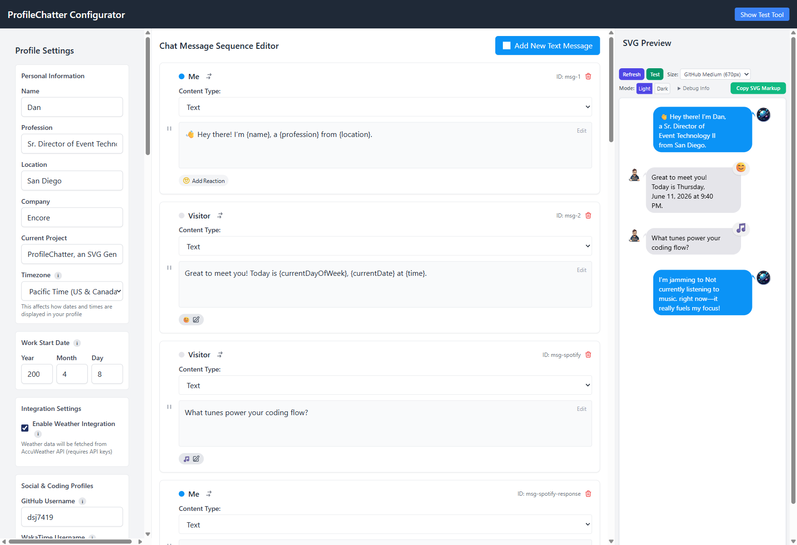
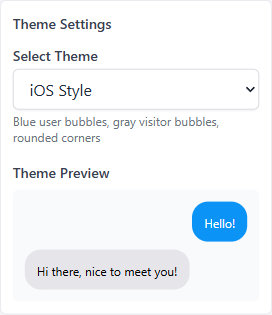
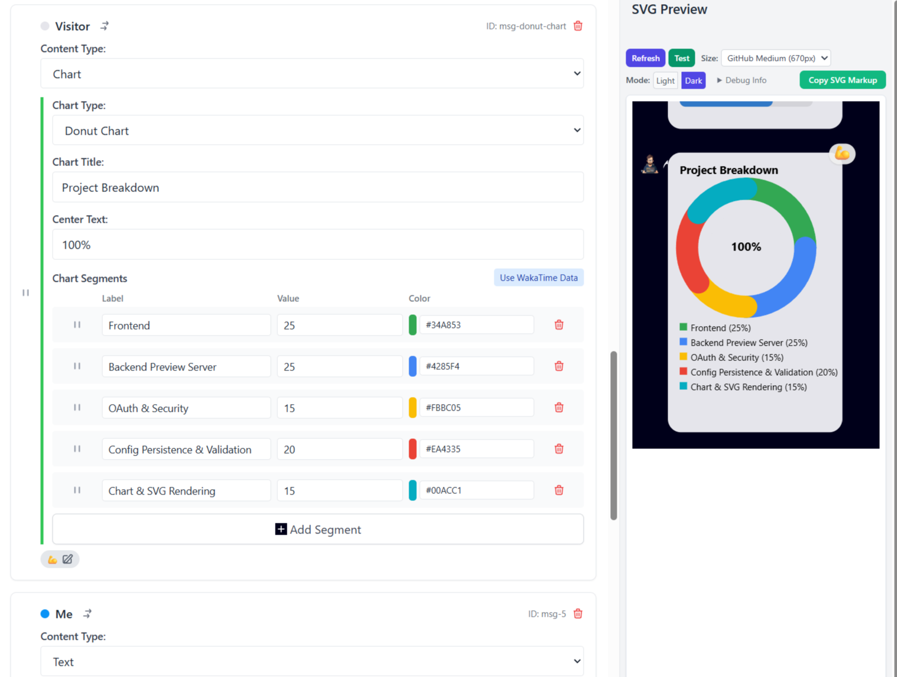
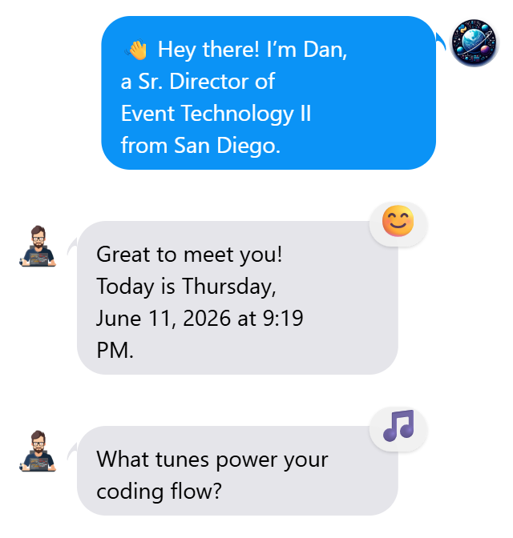
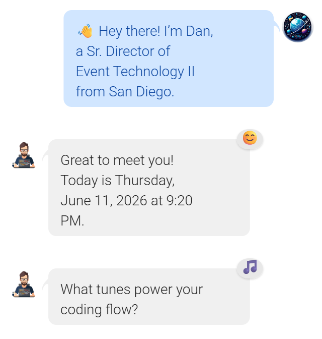
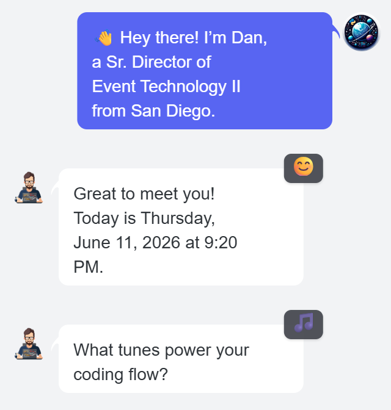
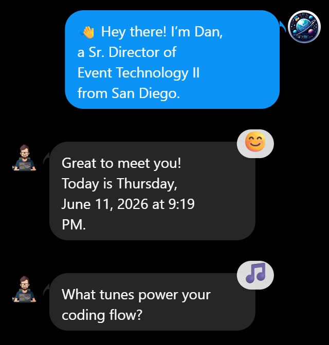
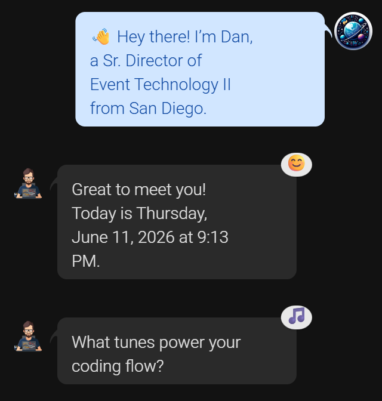
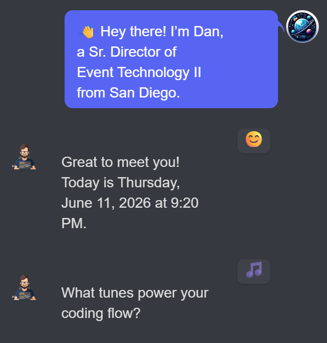
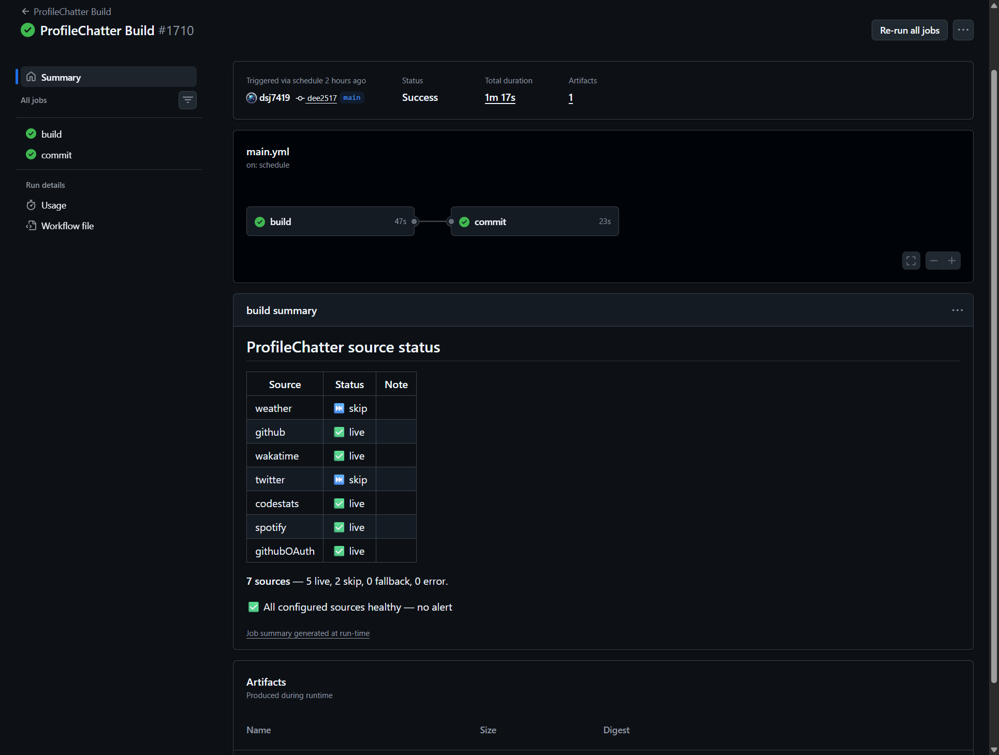

# ProfileChatter

> **Animated chat bubbles that talk for you** — a self‑updating, messaging‑style panel for your GitHub&nbsp;profile, built from live data and rendered to an SVG by GitHub Actions.


---

## What it is

ProfileChatter turns your GitHub profile README into a **living conversation** that updates itself — your latest repos, coding activity, now‑playing track, and more, in an iOS / Android / Discord‑style chat panel. Set it up once and it keeps talking: GitHub Actions rebuild the SVG every few hours and commit it back to your repo.

A basic, self‑updating profile works with **no optional API keys** — your GitHub repo/follower counts and date/time render out of the box. Richer integrations (WakaTime, Spotify, weather, Code::Stats, Twitter/X) are opt‑in add‑ons you can wire up whenever you like.

---

## ✨ Highlights

| | |
| --- | --- |
| **Works with no optional API keys** | A basic, self‑updating profile needs only a fork + GitHub Actions. Live GitHub stats and date/time work immediately; everything else is optional. |
| **No‑code Configurator UI** | `npm run config:dev` launches a Svelte app to visually customise messages, themes, avatars, charts & more. |
| **Dynamic charts** | Donut & horizontal‑bar charts with per‑segment animation — auto‑generated from WakaTime or any JSON array. |
| **Themes that fit in** | iOS, Android & **Discord** styles out of the box — add your own with a single theme object in `config.js` or through the UI. |
| **Smooth, adaptive animations** | Dynamic scroll easing, typing indicators, bubble pop‑ins, chart draw effects. |
| **Reliable, observable builds** | Every run reports per‑source health (live / skipped / failed) in the Actions step summary — a configured source that fails is surfaced, not silently faked. |

---

## 🚀 Quick Start

A basic, self‑updating profile works with **no optional API keys**. You fork the repo, enable GitHub Actions, and embed one image.

### 1. Get a working profile (no optional API keys)

1. **Fork** this repository to your account.
2. **Enable GitHub Actions on your fork** — _Settings → Actions → General → "Allow all actions and reusable workflows"_. (Forks ship with Actions disabled.)
3. **Embed the badge** in your profile README — the special repo named after your username (`<you>/<you>`):

   ```markdown
   
   ```

   Replace `<you>` with your GitHub username.

The workflow rebuilds your SVG every 6 hours (and on push) and commits the fresh image back to your fork — **no commit token to set up**. (GitHub caches profile images; the workflow appends a changing `?ts=` value so your README always shows the latest render.)

> **Tip:** to trigger the first build immediately, go to your fork's _Actions → "ProfileChatter Build" → Run workflow_.

### 2. Personalize (optional) — the Configurator UI

Clone your fork and launch the visual editor:

```bash
git clone https://github.com/<you>/ProfileChatter.git
cd ProfileChatter
npm install          # one install covers the Configurator UI too (npm workspaces)
npm run config:dev   # opens the Svelte Configurator with a live preview
```

The no-code editor — visually customise your profile, messages, themes, avatars, and charts with a live preview:

| Editor | Themes | Charts |
|:---:|:---:|:---:|
|  |  |  |

Edit your profile, theme, avatars, chat messages, and charts, then click **Export Configuration** to save `profileChatterConfig.json`. Commit it to your fork:

```bash
git add profileChatterConfig.json
git commit -m "Personalise ProfileChatter"
git push
```

Prefer to preview the default output without the UI? `npm run build` renders `dist/profile-chat.svg` locally.

---

## 🎨 Themes

Three built-in styles — **iOS**, **Android**, and **Discord** — each adapts automatically to the viewer's light or dark mode, so your profile looks native everywhere.

**Light**

| iOS | Android | Discord |
|:---:|:---:|:---:|
|  |  |  |

**Dark**

| iOS | Android | Discord |
|:---:|:---:|:---:|
|  |  |  |

---

## 🛠 How it Works

1. **GitHub Actions** (`.github/workflows/main.yml`) run on a 6‑hour cron or any push.
2. **Node scripts** fetch data and render a fresh SVG to `dist/`.
3. **TimelineBuilder → SvgRenderer** convert chat data + config into animated markup.
4. The build commits the updated SVG back to your repo, and your profile README picks it up.

**Configuration priority** (highest → lowest):

1. **`profileChatterConfig.json`** — created by the Configurator UI; wins for the sections it contains.
2. **`src/config/config.js`** — base defaults for themes, layout, profile, etc.
3. **`data/chatData.json`** — default chat messages when no config provides a `chatMessages` array.

> **Advanced (manual editing):** you can edit `src/config/config.js` directly — copy a theme object and rename it then set `activeTheme`, tweak layout/animation timings, or toggle an integration (e.g. `wakatime.enabled = false`). The Configurator UI is the recommended path.

---

## 🛡️ Safe & reliable by design

A profile widget is only worth embedding if you can trust it. ProfileChatter is built so it stays honest on its own:

- **No hidden failures.** Each data source is fetched independently, and the build records whether it succeeded — so a green build can't silently show stale or made‑up data.
- **Visible health every run.** The status manifest reports each source as **live / skip / fallback / error** in the Actions step summary (and `dist/status-manifest.json`).
- **Self‑monitoring.** When a configured source keeps failing, ProfileChatter opens **one** GitHub issue and closes it on recovery — no spam.
- **Honest numbers.** The "commits last year" value is the real GitHub contribution count, not a fabricated estimate.
- **Intentional opt‑outs never false‑alarm.** Integrations you haven't set up are skipped, not treated as failures.
- **Secure local tooling.** The Configurator's preview server binds to loopback and requires a session token plus strict CORS/CSRF checks.
- **Tested & gated.** ~500 behavior‑asserting tests run on every PR behind a required CI check with coverage floors.

For the deeper contributor/maintainer picture, see [ARCHITECTURE.md](ARCHITECTURE.md).

Every run publishes the status manifest to the GitHub Actions step summary — each source shown as live / skip / fallback / error:




---

## 🔌 Optional Integrations (add more live data)

> **Everything here is optional.** ProfileChatter works with **no API keys** — these only add _more_ live data. Unconfigured integrations are skipped cleanly: they never error or show placeholder data. Configure any of them in the Configurator UI or as repository secrets.

For local development, place keys in a `.env` (copy from `.env.template`). For GitHub Actions, add them as repository secrets — _Settings → Secrets and variables → Actions_.

| Service / Variable | Status | Purpose |
| --- | --- | --- |
| **GitHub (OAuth Data)** | | |
| `PAT_GITHUB_OAUTH` | ☐ Optional | Enhanced stats (stars, real commit count, primary language). |
| `GITHUB_CLIENT_ID` / `GITHUB_CLIENT_SECRET` / `GITHUB_REDIRECT_URI` | ☐ For local OAuth | Used by the local Configurator for GitHub OAuth. Default redirect: `http://127.0.0.1:3001/callback`. |
| **GitHub (Public Data)** | | |
| `PAT_GITHUB_BASIC` | ☐ Optional | Avoids unauthenticated public‑API rate limits for basic stats. |
| **WakaTime** | | |
| `WAKATIME_API_KEY` | ☐ Optional | Coding‑activity stats & dynamic charts. ([Get a key](https://wakatime.com/api-key)) |
| **Spotify** | | |
| `SPOTIFY_CLIENT_ID` / `SPOTIFY_CLIENT_SECRET` / `SPOTIFY_REFRESH_TOKEN` / `SPOTIFY_REDIRECT_URI` | ☐ Optional | "Now playing" track. |
| **Weather (AccuWeather)** | | |
| `WEATHER_API_KEY` / `LOCATION_KEY` | ☐ Off by default | Current conditions. AccuWeather is trial/paid (see below). |
| **Twitter/X** | | |
| `TWITTER_BEARER_TOKEN` | ☐ Adv. (high cost) | Live follower count (manual entry is the default). |
| **Code::Stats** | | |
| _(username in UI/config)_ | ☐ Optional | Code::Stats XP — no API key needed. |

<details>
<summary><strong>🐙 GitHub enhanced statistics setup</strong></summary>

To enable enhanced GitHub statistics in your automated builds:

1. **Create a GitHub OAuth Application** (only needed for local interactive auth)
   - Visit [GitHub Developer Settings](https://github.com/settings/developers)
   - Go to "OAuth Apps" → "New OAuth App"
   - **Application name**: "ProfileChatter" (or your preferred name); **Homepage URL**: your repo URL or `http://127.0.0.1:3001`; **Authorization callback URL**: `http://127.0.0.1:3001/callback`
   - Register, generate a client secret, and save both the Client ID and Secret

2. **Create a Personal Access Token (PAT) for CI/CD**
   - Go to [GitHub Personal Access Tokens](https://github.com/settings/tokens) → "Generate new token (classic)"
   - Name: "ProfileChatter CI/CD"; set an expiration
   - Scopes: `read:user` (read profile) and `public_repo` (public repos)
   - Generate and copy the token immediately

3. **Local setup for interactive mode**
   - Add to your `.env`:

     ```text
     GITHUB_CLIENT_ID=your_oauth_app_client_id
     GITHUB_CLIENT_SECRET=your_oauth_app_client_secret
     GITHUB_REDIRECT_URI=http://127.0.0.1:3001/callback
     ```

   - Start the server: `node configurator-ui/server/previewServer.js`
   - Visit `http://localhost:3001`, click "Connect GitHub"; a `.tokens/github.json` is created after authorizing

4. **Add the repository secret for GitHub Actions**
   - In your repo: _Settings → Secrets and variables → Actions_
   - Add `PAT_GITHUB_OAUTH` (the token from step 2)

5. **Security notes**
   - Rotate the PAT periodically; use the most restrictive scopes possible
   - Ensure `.tokens/` is in your `.gitignore`

</details>

<details>
<summary><strong>🎵 Spotify "now playing" setup</strong></summary>

1. **Create a Spotify Developer Application**
   - Visit the [Spotify Developer Dashboard](https://developer.spotify.com/dashboard), create an app
   - Note your **Client ID** and **Client Secret**
   - Add `http://127.0.0.1:3001/callback` as a Redirect URI

2. **Get your refresh token (one‑time)**
   - Create a `.env` from `.env.template` and add:

     ```text
     SPOTIFY_CLIENT_ID=your_client_id
     SPOTIFY_CLIENT_SECRET=your_client_secret
     SPOTIFY_REDIRECT_URI=http://127.0.0.1:3001/callback
     ```

   - Start the local authorization server: `node configurator-ui/server/previewServer.js`
   - Open `http://localhost:3001`, click "Connect Spotify" (or visit `http://localhost:3001/auth/spotify`), and authorize
   - A `.tokens/spotify.json` file is created with your `refresh_token`

3. **Add repository secrets for GitHub Actions**
   - Copy `refresh_token` from `.tokens/spotify.json`
   - Add `SPOTIFY_CLIENT_ID`, `SPOTIFY_CLIENT_SECRET`, `SPOTIFY_REFRESH_TOKEN`, and `SPOTIFY_REDIRECT_URI` (`http://127.0.0.1:3001/callback`) as repository secrets

4. **Security note** — never commit `.tokens/` (it's git‑ignored by default).

</details>

<details>
<summary><strong>🌤️ Weather (AccuWeather — off by default)</strong></summary>

**Weather is disabled by default** (`config.weather.enabled: false`). AccuWeather no longer offers a long‑term free developer tier — its "Free" plan is now a **14‑day trial**, with paid plans after — so it isn't a good out‑of‑the‑box default for an open‑source widget. When disabled it's treated as an intentional skip (it never errors or shows placeholder weather).

To **enable** weather, set `weather.enabled: true` (Configurator UI or `config.js`) **and** provide a valid AccuWeather key:

1. **Get an API key** at the [AccuWeather Developer Portal](https://developer.accuweather.com/) — create an App, copy the key as `WEATHER_API_KEY`.
2. **Find your Location Key** via the AccuWeather Location API, e.g. `http://dataservice.accuweather.com/locations/v1/cities/search?apikey=YOUR_API_KEY&q=YOUR_CITY_NAME` — copy the `Key` value as `LOCATION_KEY`.
3. **Add both** to your `.env` (local) or repository secrets (Actions).

</details>

<details>
<summary><strong>🐦 Twitter/X follower count (manual by default)</strong></summary>

Live API fetching is **off by default** due to significant Twitter/X API costs. The `{twitterFollowers}` placeholder uses a manually entered count (set it in the Configurator UI's "Twitter Followers (Manual)" field) — no cost, no setup.

**Advanced (live API, high cost):**

1. Set `twitter.enabled_api_fetch: true` in `profileChatterConfig.json` or `src/config/config.js`.
2. Add `TWITTER_BEARER_TOKEN` (from your [Twitter Developer Portal](https://developer.twitter.com/en/portal/dashboard)).
3. **⚠️ Cost warning:** Twitter/X charges significant fees for follower endpoints. Review current pricing and monitor usage — you are responsible for all API costs incurred.

</details>

<details>
<summary><strong>📊 Code::Stats XP</strong></summary>

Free and key‑free: your Code::Stats username is the one in your profile URL (e.g. `https://codestats.net/users/your_username` → `your_username`). Enter it in the Configurator UI's "Code::Stats Username" field.

</details>

---

## 📖 Reference

### 💬 Message placeholders

| Placeholder | Injected value |
| --- | --- |
| `{name}` / `{profession}` / `{location}` / `{company}` | Profile details |
| `{workTenure}` | Human‑readable tenure — e.g. "1 year 2 months" |
| `{currentDayOfWeek}` / `{currentDate}` | Localised date strings |
| `{dayName}` / `{time24}` / `{timezoneAbbr}` | Granular date/time placeholders |
| `{temperature}` / `{weatherDescription}` / `{emoji}` | Current weather (if enabled) |
| `{githubPublicRepos}` / `{githubFollowers}` | GitHub stats |
| `{wakatime_summary}` / `{wakatime_top_language}` / `{wakatime_top_language_percent}` | WakaTime |
| `{twitterFollowers}` | Twitter/X followers (manual input by default) |
| `{codestatsXP}` | Code::Stats XP |

### 📈 Dynamic chart data

Inside a chart's `items` array you can put:

```jsonc
"items": "{wakatime_chart_data}"
```

and the build replaces it with the top five languages from your last 7 days on WakaTime.

**Chart recipe example:**

```jsonc
{
  "sender": "me",
  "contentType": "chart",
  "chartData": {
    "type": "donut",
    "title": "{wakatime_top_language} usage",
    "centerText": "{wakatime_top_language_percent}%",
    "items": "{wakatime_chart_data}"
  }
}
```

### 🖼️ Embedding in your profile README

```markdown

```

Replace `<you>` with your GitHub username. The `?ts=` value is bumped automatically by CI so GitHub serves the latest render rather than a cached copy.

### 🗜️ Local commands

| Command | Description |
| --- | --- |
| `npm run build` | Render the SVG to `dist/` using the current config |
| `npm run preview` | Build & open `test.html` for a live animation preview |
| `npm run config:dev` | Launch the Configurator UI |
| `npm run config:build` | Create a static build of the Configurator |
| `npm run format` | Prettier formatting |
| `npm run lint` | ESLint checks |
| `npm run test` | Run the test suite |
| `npm run verify` | Lint + tests with coverage + Configurator build (the CI gate) |

---

## 🛟 Troubleshooting

### Where do I find the status summary? (start here)

Almost every issue below is diagnosed the same way: open **GitHub → Actions → the latest "ProfileChatter Build" run → Summary**. Each run posts a per‑source health table there. (The same data is in `dist/status-manifest.json`, uploaded in that run's `updated-files` artifact.)

Each source reports one of four states:

- **live** — fetched successfully.
- **skip** — intentionally disabled or unconfigured. **Not a problem** — you just haven't set that integration up.
- **fallback** — a **configured** source failed and rendered defaults / partial data. **This is what needs attention.** `401 / 403 / 429` are flagged high‑signal (auth or rate‑limit).
- **error** — a hard source failure with no usable value.

> **Rule of thumb: `skip` is fine; `fallback` and `error` need attention.** When a configured source keeps failing, ProfileChatter opens a single GitHub issue (and closes it on recovery) — see the last entry.

### My profile SVG isn't updating

GitHub's image CDN caches profile images. The workflow appends a changing `?ts=` value to the badge on every run, so it should refresh within a build cycle — hard‑refresh the page, or wait for the next 6‑hour build. Confirm the latest **ProfileChatter Build** actually ran and committed (_Actions → latest run_).

### Nothing builds on my fork

Forks ship with Actions **disabled**. Enable them: _Settings → Actions → General → "Allow all actions and reusable workflows"_. Then trigger the first build: _Actions → "ProfileChatter Build" → Run workflow_.

### Stats show defaults (e.g. 12 repos / 48 followers)

Those are placeholder defaults — a GitHub source fell back. Check the status summary:

- **Public stats** (`{githubPublicRepos}` / `{githubFollowers}`) use the unauthenticated GitHub API, which is rate‑limited on shared CI IPs. Setting `PAT_GITHUB_BASIC` avoids this.
- **Enhanced stats** (stars / commits / language) need `PAT_GITHUB_OAUTH`. Missing → the source **skips**; present but **expired/invalid** → it **falls back** (flagged high‑signal). Rotate the PAT.

### Weather isn't showing

Weather is **off by default** (AccuWeather is trial/paid) — that's a `skip`, not a failure. To enable it, see [Optional Integrations](#-optional-integrations-add-more-live-data).

### Spotify / WakaTime / Code::Stats are blank

If you haven't configured them, they're an intentional **skip** — nothing is wrong. To turn them on, see [Optional Integrations](#-optional-integrations-add-more-live-data). If one is configured but shows **fallback**, read its error in the status summary (usually an expired token or a rate limit).

### Auto-commit stopped

The build commits the rendered SVG back to your repo. On a fork this uses the default `GITHUB_TOKEN` automatically — no setup needed. If you added a custom commit PAT and it **expired**, the commit job fails; rotate it or remove it (the default token takes over).

### What's the auto-opened "source(s) failing" issue?

When a **configured** source keeps failing, ProfileChatter opens **one** GitHub issue summarizing which sources fell back (`401 / 403 / 429` flagged high‑signal), updates it while the problem persists, and **closes it on recovery**. It never spams, and intentional skips never open an issue.

---

## 📺 See It in Action

- **Dan Johnson** — <https://github.com/dsj7419>

> **Show off yours!** Open a PR to add your profile to this list and inspire others.

---

## 🤝 Contributing

PRs are welcome! We have a comprehensive test suite (~480 tests) integrated into CI. Please ensure any backend code contributions include relevant tests.

**Ideas for contributions:**

- New themes (WhatsApp, Telegram, custom designs…)
- Extra data sources (Dev.to posts, Stack Overflow rep, etc.)
- Advanced theming tools (e.g. themes that adapt to light/dark OS modes)
- Documentation improvements
- Performance & build‑time optimisations

**Getting started:**

- Read [CONTRIBUTING.md](CONTRIBUTING.md) for detailed guidelines
- Open an issue using our Bug Report or Feature Request templates
- All contributions are welcome, from bug fixes to new features!

---

## 📝 License

[MIT](LICENSE) © 2025 Dan Johnson.

Third‑party materials bundled or embedded in the output (the Inter font and GitHub language colors) are credited in [NOTICE](NOTICE).

---

## 🙌 Acknowledgements

AccuWeather API • GitHub API • WakaTime • Twitter/X API • Code::Stats • Node.js • Svelte • Tailwind CSS — and **you** for building something awesome.
